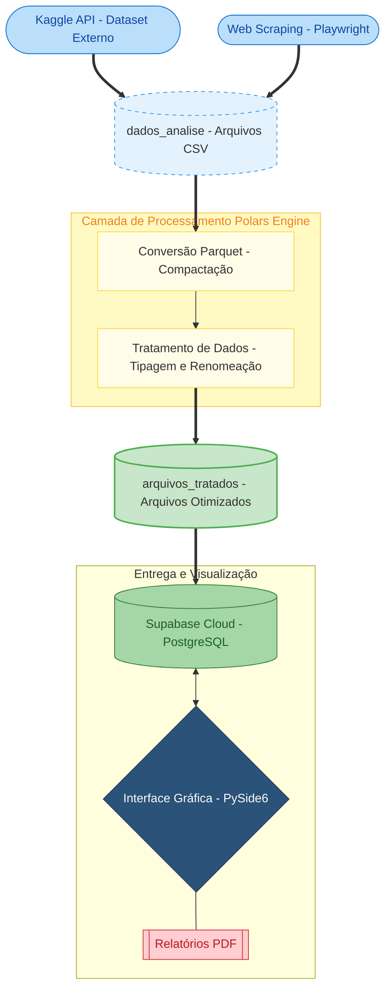

#  Projeto Integrador ETL: Pipeline Cloud-Native

Este projeto implementa um pipeline de dados completo (Extração, Transformação e Carga) com uma interface gráfica moderna e armazenamento em nuvem (Supabase). Abaixo, detalhamos a arquitetura e o fluxo de dados para apresentação acadêmica e documentação no GitHub.

## 📊 Fluxograma do Processo (Pipeline ETL)



---

## 🏗️ Estrutura da Árvore de Diretórios

O projeto está organizado de forma modular para facilitar a manutenção e escalabilidade:

```text
PROJETO-ETL/
├── backend/                # Núcleo de Processamento (Engine)
│   ├── main.py             # Orquestrador principal do pipeline
│   ├── extracao_*.py       # Scripts de coleta (API e Web)
│   ├── tratando.py         # Lógica de limpeza com Polars
│   ├── inserir_dados.py    # Conexão e Carga no Supabase (Nuvem)
│   └── db_manager.py       # Gestão do banco de dados
├── frontend/               # Interface do Usuário (GUI)
│   ├── app_gui.py          # Janela principal (Dashboard)
│   ├── estilos_visuais.py  # Definições de UI/UX
│   └── componentes_*.py    # Widgets e painéis modulares
├── dados_analise/          # Raw Data (CSV originais)
├── dados_convertidos_prt/  # Cold Storage (Parquet bruto)
├── arquivos_tratados/      # Staging Area (Parquet processado)
└── requirements.txt        # Dependências do sistema
```

---

## ⚙️ Funcionamento Detalhado

### 1. Extração (Extraction)
Utilizamos uma abordagem híbrida:
*   **Kaggle API:** Coleta automatizada de datasets estruturados.
*   **Playwright:** Automação de navegador para capturar dados de fontes web que não possuem API.

### 2. Transformação (Transformation)
Focamos em performance utilizando a biblioteca **Polars**:
*   **Conversão:** Transformamos CSVs pesados em arquivos Parquet (compactos e rápidos).
*   **Limpeza:** Renomeação de colunas para padrão de banco de dados, conversão de tipos (datas e valores monetários) e tratamento de valores nulos.

### 3. Carga (Load)
*   **Supabase:** Os dados são enviados para tabelas de *staging* no PostgreSQL hospedado na nuvem.
*   **SQLAlchemy:** Gerencia as transações e garante a integridade dos dados durante o envio.

### 4. Interface e Analytics (UI/UX)
*   **PySide6:** Interface profissional com suporte a temas.
*   **Visualização:** Integração com Plotly e Matplotlib para gerar insights em tempo real e relatórios em PDF.

---

## 🛠️ Tecnologias Utilizadas

*   **Linguagem:** Python 3.10+
*   **Manipulação de Dados:** Polars, Pandas, NumPy.
*   **Interface:** PySide6 (Qt para Python).
*   **Banco de Dados:** Supabase (PostgreSQL Cloud).
*   **Web Scraping:** Playwright.
*   **Relatórios:** ReportLab, Plotly.

---

*Documentação gerada automaticamente para o Projeto Integrador ETL.*
